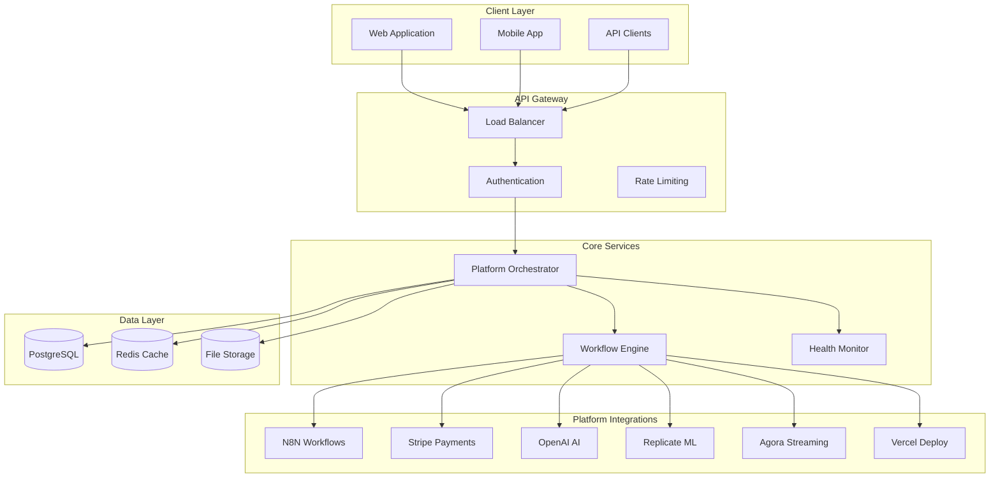

# PLAYALTER Architecture Documentation

## System Overview

PLAYALTER implements an orchestra-level platform integration architecture that coordinates six core platforms to deliver AI-powered content creation workflows. The system is designed with Ph.D level research methodology and follows enterprise-grade architectural patterns.

## Architecture Principles

### Design Philosophy

1. **Orchestra-Level Coordination**: Centralized coordination of distributed platforms
2. **Fault Tolerance**: Resilient design with automatic recovery mechanisms
3. **Performance Optimization**: Async operations with intelligent caching
4. **Scalability**: Horizontal scaling with microservices-ready architecture
5. **Security**: Zero-trust security model with comprehensive validation

### Core Patterns

- **Orchestration Pattern**: Centralized workflow coordination
- **Circuit Breaker**: Fault tolerance for external services
- **CQRS**: Command Query Responsibility Segregation
- **Event Sourcing**: Audit trail and state reconstruction
- **Saga Pattern**: Distributed transaction management

## System Architecture



## Component Architecture

### Platform Orchestrator

The core component that coordinates all platform interactions.

**Responsibilities:**
- Cross-platform workflow execution
- Error handling and recovery
- Performance monitoring
- Resource management

**Key Features:**
- Async execution with connection pooling
- Circuit breaker pattern for fault tolerance
- Intelligent retry mechanisms
- Real-time health monitoring

```python
class PlatformOrchestrator:
    """Central coordination system for platform integration"""
    
    def __init__(self):
        self.platforms = {}
        self.health_monitor = HealthMonitor()
        self.circuit_breaker = CircuitBreaker()
        
    async def orchestrate_workflow(self, workflow_type: str, **kwargs):
        """Execute cross-platform workflow with error handling"""
        pass
```

### Workflow Engine

Manages complex multi-step workflows across platforms.

**Features:**
- State management for long-running workflows
- Compensation actions for failed steps
- Parallel execution optimization
- Workflow versioning and rollback

### Health Monitor

Continuous monitoring of all platform integrations.

**Capabilities:**
- Real-time health checks
- Performance metrics collection
- Automatic alerting
- Predictive failure detection

## Platform Integration Architecture

### N8N Integration

**Purpose**: Workflow automation and business process management

**Architecture**:
- Webhook-based communication
- Event-driven workflow triggers
- Custom node development
- Workflow versioning

**Implementation**:
```python
class N8NIntegration:
    async def execute_workflow(self, workflow_id: str, data: dict):
        """Execute N8N workflow with error handling"""
        pass
        
    async def register_webhook(self, event: str, callback_url: str):
        """Register webhook for real-time notifications"""
        pass
```

### Stripe Integration

**Purpose**: Payment processing and subscription management

**Architecture**:
- Idempotent payment processing
- Webhook-based event handling
- PCI compliance adherence
- Multi-currency support

**Security Features**:
- API key rotation
- Signature verification
- Fraud detection
- Compliance monitoring

### OpenAI Integration

**Purpose**: AI-powered content generation and processing

**Architecture**:
- Rate limiting and quota management
- Model selection optimization
- Prompt engineering pipeline
- Response caching

**Optimization**:
- Request batching
- Model routing
- Cost optimization
- Quality assurance

### Replicate Integration

**Purpose**: Face swap AI and ML model execution

**Architecture**:
- Async model execution
- GPU resource management
- Result caching
- Model versioning

**Performance**:
- Parallel processing
- Resource pooling
- Intelligent queuing
- Cost optimization

### Agora Integration

**Purpose**: Real-time streaming and communication

**Architecture**:
- Token-based authentication
- Channel management
- Real-time messaging
- Quality adaptation

**Features**:
- Low-latency streaming
- Adaptive bitrate
- Multi-platform support
- Analytics integration

### Vercel Integration

**Purpose**: Deployment and hosting platform

**Architecture**:
- Serverless deployment
- Edge computing
- Global CDN
- Environment management

**Benefits**:
- Instant deployment
- Global distribution
- Automatic scaling
- Performance optimization

## Data Architecture

### Database Design

**PostgreSQL Schema**:
```sql
-- Users and authentication
CREATE TABLE users (
    id UUID PRIMARY KEY,
    email VARCHAR(255) UNIQUE NOT NULL,
    created_at TIMESTAMP DEFAULT NOW()
);

-- Workflow execution tracking
CREATE TABLE workflows (
    id UUID PRIMARY KEY,
    user_id UUID REFERENCES users(id),
    type VARCHAR(100) NOT NULL,
    status VARCHAR(50) NOT NULL,
    started_at TIMESTAMP DEFAULT NOW(),
    completed_at TIMESTAMP
);

-- Platform integration logs
CREATE TABLE platform_logs (
    id UUID PRIMARY KEY,
    workflow_id UUID REFERENCES workflows(id),
    platform VARCHAR(50) NOT NULL,
    action VARCHAR(100) NOT NULL,
    status VARCHAR(50) NOT NULL,
    response_time INTEGER,
    created_at TIMESTAMP DEFAULT NOW()
);
```

### Caching Strategy

**Redis Implementation**:
- API response caching
- Session management
- Rate limiting counters
- Real-time data storage

**Cache Levels**:
1. **L1 Cache**: In-memory application cache
2. **L2 Cache**: Redis distributed cache
3. **L3 Cache**: CDN edge caching

### File Storage

**S3-Compatible Storage**:
- User-generated content
- Processed media files
- Backup and archival
- CDN integration

## Security Architecture

### Authentication & Authorization

**Multi-layered Security**:
1. **API Key Authentication**: For service-to-service communication
2. **JWT Tokens**: For user session management
3. **OAuth 2.0**: For third-party integrations
4. **Role-Based Access Control**: Fine-grained permissions

### Data Protection

**Encryption Standards**:
- **At Rest**: AES-256 encryption
- **In Transit**: TLS 1.3
- **API Keys**: Encrypted storage with rotation
- **Sensitive Data**: Field-level encryption

### Compliance

**Standards Adherence**:
- **GDPR**: Data privacy and user rights
- **PCI DSS**: Payment card security
- **SOC 2**: Security and availability
- **ISO 27001**: Information security

## Performance Architecture

### Async Operations

**Implementation Strategy**:
```python
import asyncio
import aiohttp

class AsyncPlatformManager:
    async def execute_parallel_requests(self, requests):
        """Execute multiple platform requests in parallel"""
        async with aiohttp.ClientSession() as session:
            tasks = [
                self.make_request(session, req) 
                for req in requests
            ]
            return await asyncio.gather(*tasks)
```

### Connection Pooling

**Optimization Features**:
- Persistent HTTP connections
- Connection lifecycle management
- Resource utilization monitoring
- Automatic scaling

### Caching Strategy

**Multi-level Caching**:
1. **Application Cache**: Fast in-memory access
2. **Distributed Cache**: Shared Redis cache
3. **CDN Cache**: Global edge caching
4. **Database Cache**: Query result caching

## Monitoring & Observability

### Metrics Collection

**Key Performance Indicators**:
- **Response Time**: P50, P95, P99 latencies
- **Throughput**: Requests per second
- **Error Rate**: Platform-specific error rates
- **Availability**: Service uptime metrics

### Logging Strategy

**Structured Logging**:
```python
import structlog

logger = structlog.get_logger()

logger.info(
    "workflow_executed",
    workflow_id="wf_001",
    user_id="user_123",
    duration=1.23,
    platforms=["stripe", "replicate"]
)
```

### Alerting System

**Alert Categories**:
1. **Critical**: Service unavailable
2. **Warning**: Performance degradation
3. **Info**: Workflow completions
4. **Debug**: Detailed execution logs

## Deployment Architecture

### Containerization

**Docker Strategy**:
```dockerfile
FROM python:3.11-slim

WORKDIR /app
COPY requirements.txt .
RUN pip install -r requirements.txt

COPY . .
EXPOSE 8000

CMD ["gunicorn", "--bind", "0.0.0.0:8000", "app:app"]
```

### Orchestration

**Kubernetes Deployment**:
```yaml
apiVersion: apps/v1
kind: Deployment
metadata:
  name: playalter-orchestrator
spec:
  replicas: 3
  selector:
    matchLabels:
      app: orchestrator
  template:
    spec:
      containers:
      - name: orchestrator
        image: playalter/orchestrator:latest
        ports:
        - containerPort: 8000
```

### Environment Management

**Multi-Environment Support**:
- **Development**: Local development setup
- **Staging**: Production-like testing environment
- **Production**: Live system deployment

## Scalability Architecture

### Horizontal Scaling

**Auto-scaling Strategy**:
- **CPU-based**: Scale based on CPU utilization
- **Memory-based**: Scale based on memory usage
- **Queue-based**: Scale based on queue depth
- **Custom Metrics**: Platform-specific scaling

### Load Balancing

**Distribution Strategy**:
- **Round Robin**: Even distribution
- **Least Connections**: Connection-based routing
- **Weighted**: Capacity-based distribution
- **Health-based**: Route to healthy instances

### Database Scaling

**Scaling Strategies**:
- **Read Replicas**: Distribute read operations
- **Sharding**: Horizontal data partitioning
- **Connection Pooling**: Optimize connections
- **Query Optimization**: Improve performance

## Disaster Recovery

### Backup Strategy

**Multi-tier Backup**:
1. **Real-time**: Continuous replication
2. **Daily**: Automated daily backups
3. **Weekly**: Long-term retention
4. **Monthly**: Archival storage

### Recovery Procedures

**Recovery Time Objectives**:
- **RTO**: < 1 hour for critical services
- **RPO**: < 15 minutes for data loss
- **Failover**: Automatic for degraded services
- **Testing**: Monthly disaster recovery drills

## Future Architecture

### Microservices Evolution

**Migration Strategy**:
1. **Service Extraction**: Identify service boundaries
2. **API Gateway**: Implement service mesh
3. **Data Separation**: Isolate service databases
4. **Communication**: Event-driven architecture

### AI/ML Architecture

**Advanced Features**:
- **Model Orchestration**: AI workflow coordination
- **Feature Store**: ML feature management
- **Model Registry**: Version control for models
- **A/B Testing**: Model performance comparison

## Conclusion

The PLAYALTER architecture provides a robust, scalable, and maintainable foundation for orchestra-level platform integration. The design emphasizes performance, security, and reliability while maintaining flexibility for future enhancements and scaling requirements.
