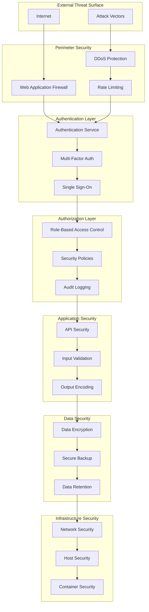

# PLAYALTER Security Documentation

## Security Overview

PLAYALTER implements enterprise-grade security practices following Ph.D level research methodology and industry best practices. Our security framework addresses all aspects of a multi-platform integration system with zero-trust principles.

## Security Framework

### Core Security Principles

1. **Defense in Depth**: Multiple layers of security controls
2. **Least Privilege**: Minimal access rights for users and systems
3. **Zero Trust**: Never trust, always verify
4. **Fail Secure**: System fails to secure state
5. **Security by Design**: Security integrated from architecture phase

### Security Architecture



## Authentication & Authorization

### Multi-Factor Authentication

**Implementation**:
```python
from cryptography.fernet import Fernet
import pyotp
import jwt

class AuthenticationService:
    def __init__(self):
        self.encryption_key = Fernet.generate_key()
        self.fernet = Fernet(self.encryption_key)
        
    def generate_totp_secret(self, user_id: str) -> str:
        """Generate TOTP secret for 2FA"""
        secret = pyotp.random_base32()
        encrypted_secret = self.fernet.encrypt(secret.encode())
        # Store encrypted_secret in database
        return secret
        
    def verify_totp(self, user_id: str, token: str) -> bool:
        """Verify TOTP token"""
        # Retrieve and decrypt secret from database
        encrypted_secret = self.get_user_totp_secret(user_id)
        secret = self.fernet.decrypt(encrypted_secret).decode()
        
        totp = pyotp.TOTP(secret)
        return totp.verify(token, valid_window=1)
```

### JWT Token Management

**Security Features**:
- **Short-lived Access Tokens**: 15-minute expiry
- **Refresh Token Rotation**: New refresh token on each use
- **Token Blacklisting**: Immediate revocation capability
- **Signature Verification**: RS256 algorithm with key rotation

**Implementation**:
```python
import jwt
from datetime import datetime, timedelta
from cryptography.hazmat.primitives import serialization

class JWTManager:
    def __init__(self, private_key_path: str, public_key_path: str):
        with open(private_key_path, 'rb') as f:
            self.private_key = serialization.load_pem_private_key(
                f.read(), password=None
            )
        with open(public_key_path, 'rb') as f:
            self.public_key = serialization.load_pem_public_key(f.read())
            
    def generate_access_token(self, user_id: str, roles: list) -> str:
        """Generate short-lived access token"""
        payload = {
            'user_id': user_id,
            'roles': roles,
            'exp': datetime.utcnow() + timedelta(minutes=15),
            'iat': datetime.utcnow(),
            'type': 'access'
        }
        return jwt.encode(payload, self.private_key, algorithm='RS256')
        
    def verify_token(self, token: str) -> dict:
        """Verify and decode JWT token"""
        try:
            payload = jwt.decode(
                token, self.public_key, algorithms=['RS256']
            )
            # Check token blacklist
            if self.is_token_blacklisted(token):
                raise jwt.InvalidTokenError("Token has been revoked")
            return payload
        except jwt.ExpiredSignatureError:
            raise jwt.InvalidTokenError("Token has expired")
```

### Role-Based Access Control (RBAC)

**Role Hierarchy**:
```python
class SecurityRoles:
    SUPER_ADMIN = "super_admin"
    ADMIN = "admin"
    DEVELOPER = "developer"
    USER = "user"
    READONLY = "readonly"
    
    ROLE_PERMISSIONS = {
        SUPER_ADMIN: [
            "platform.orchestrate",
            "user.manage",
            "system.configure",
            "security.audit"
        ],
        ADMIN: [
            "platform.orchestrate",
            "user.manage",
            "workflow.manage"
        ],
        DEVELOPER: [
            "platform.orchestrate",
            "workflow.create",
            "workflow.execute"
        ],
        USER: [
            "workflow.execute",
            "content.create"
        ],
        READONLY: [
            "workflow.view",
            "content.view"
        ]
    }
```

## API Security

### Input Validation & Sanitization

**Comprehensive Validation**:
```python
from marshmallow import Schema, fields, validate, ValidationError
import bleach
import html

class WorkflowRequestSchema(Schema):
    workflow_type = fields.Str(
        required=True,
        validate=validate.OneOf(['face_swap', 'content_generation']),
        error_messages={'required': 'Workflow type is required'}
    )
    parameters = fields.Dict(
        required=True,
        validate=validate.Length(max=1000),
        error_messages={'required': 'Parameters are required'}
    )
    
    def sanitize_input(self, data):
        """Sanitize input data to prevent XSS and injection attacks"""
        if isinstance(data, dict):
            return {
                key: self.sanitize_input(value) 
                for key, value in data.items()
            }
        elif isinstance(data, str):
            # HTML sanitization
            cleaned = bleach.clean(data, tags=[], attributes={})
            # HTML entity encoding
            return html.escape(cleaned)
        return data

class APIValidator:
    @staticmethod
    def validate_request(schema_class, request_data):
        """Validate and sanitize API request"""
        schema = schema_class()
        try:
            # Validate structure
            validated_data = schema.load(request_data)
            # Sanitize content
            return schema.sanitize_input(validated_data)
        except ValidationError as err:
            raise ValueError(f"Validation error: {err.messages}")
```

### Rate Limiting & DDoS Protection

**Multi-layered Rate Limiting**:
```python
import asyncio
import time
from collections import defaultdict, deque

class RateLimiter:
    def __init__(self):
        self.requests = defaultdict(deque)
        self.blocked_ips = {}
        
    async def check_rate_limit(self, client_ip: str, endpoint: str) -> bool:
        """Check if request is within rate limits"""
        current_time = time.time()
        key = f"{client_ip}:{endpoint}"
        
        # Clean old requests
        while (self.requests[key] and 
               current_time - self.requests[key][0] > 60):
            self.requests[key].popleft()
            
        # Check rate limits
        request_count = len(self.requests[key])
        
        # Different limits for different endpoints
        limits = {
            'default': 100,  # 100 requests per minute
            'auth': 10,      # 10 auth attempts per minute
            'upload': 5,     # 5 uploads per minute
            'orchestrate': 20 # 20 orchestration requests per minute
        }
        
        limit = limits.get(endpoint, limits['default'])
        
        if request_count >= limit:
            # Block IP temporarily
            self.blocked_ips[client_ip] = current_time + 300  # 5-minute block
            return False
            
        # Add current request
        self.requests[key].append(current_time)
        return True
        
    def is_ip_blocked(self, client_ip: str) -> bool:
        """Check if IP is currently blocked"""
        if client_ip in self.blocked_ips:
            if time.time() > self.blocked_ips[client_ip]:
                del self.blocked_ips[client_ip]
                return False
            return True
        return False
```

### SQL Injection Prevention

**Parameterized Queries**:
```python
import asyncpg
from typing import List, Dict, Any

class SecureDatabase:
    def __init__(self, connection_string: str):
        self.connection_string = connection_string
        
    async def execute_query(self, query: str, parameters: tuple = ()) -> List[Dict]:
        """Execute parameterized query safely"""
        conn = await asyncpg.connect(self.connection_string)
        try:
            # Use parameterized queries to prevent SQL injection
            result = await conn.fetch(query, *parameters)
            return [dict(row) for row in result]
        finally:
            await conn.close()
            
    async def get_user_workflows(self, user_id: str) -> List[Dict]:
        """Get user workflows with parameter binding"""
        query = """
            SELECT id, type, status, created_at 
            FROM workflows 
            WHERE user_id = $1 
            ORDER BY created_at DESC
        """
        return await self.execute_query(query, (user_id,))
```

## Data Protection

### Encryption at Rest

**Field-Level Encryption**:
```python
from cryptography.fernet import Fernet
from cryptography.hazmat.primitives import hashes
from cryptography.hazmat.primitives.kdf.pbkdf2 import PBKDF2HMAC
import base64
import os

class DataEncryption:
    def __init__(self, master_key: str):
        self.master_key = master_key.encode()
        
    def derive_key(self, salt: bytes) -> bytes:
        """Derive encryption key from master key and salt"""
        kdf = PBKDF2HMAC(
            algorithm=hashes.SHA256(),
            length=32,
            salt=salt,
            iterations=100000,
        )
        key = base64.urlsafe_b64encode(kdf.derive(self.master_key))
        return key
        
    def encrypt_field(self, data: str) -> dict:
        """Encrypt sensitive field data"""
        salt = os.urandom(16)
        key = self.derive_key(salt)
        fernet = Fernet(key)
        
        encrypted_data = fernet.encrypt(data.encode())
        
        return {
            'encrypted_data': base64.b64encode(encrypted_data).decode(),
            'salt': base64.b64encode(salt).decode()
        }
        
    def decrypt_field(self, encrypted_field: dict) -> str:
        """Decrypt sensitive field data"""
        salt = base64.b64decode(encrypted_field['salt'])
        encrypted_data = base64.b64decode(encrypted_field['encrypted_data'])
        
        key = self.derive_key(salt)
        fernet = Fernet(key)
        
        decrypted_data = fernet.decrypt(encrypted_data)
        return decrypted_data.decode()
```

### Encryption in Transit

**TLS Configuration**:
```python
import ssl
import aiohttp

class SecureHTTPClient:
    def __init__(self):
        # Create secure SSL context
        self.ssl_context = ssl.create_default_context()
        self.ssl_context.check_hostname = True
        self.ssl_context.verify_mode = ssl.CERT_REQUIRED
        self.ssl_context.minimum_version = ssl.TLSVersion.TLSv1_2
        
        # Disable weak ciphers
        self.ssl_context.set_ciphers('ECDHE+AESGCM:ECDHE+CHACHA20:DHE+AESGCM:DHE+CHACHA20:!aNULL:!MD5:!DSS')
        
    async def make_secure_request(self, url: str, **kwargs):
        """Make HTTPS request with secure TLS configuration"""
        connector = aiohttp.TCPConnector(ssl=self.ssl_context)
        async with aiohttp.ClientSession(connector=connector) as session:
            async with session.get(url, **kwargs) as response:
                return await response.json()
```

## Platform Security

### N8N Security

**Webhook Security**:
```python
import hmac
import hashlib

class N8NWebhookSecurity:
    def __init__(self, webhook_secret: str):
        self.webhook_secret = webhook_secret.encode()
        
    def verify_webhook_signature(self, payload: bytes, signature: str) -> bool:
        """Verify N8N webhook signature"""
        expected_signature = hmac.new(
            self.webhook_secret,
            payload,
            hashlib.sha256
        ).hexdigest()
        
        # Use constant-time comparison to prevent timing attacks
        return hmac.compare_digest(
            f"sha256={expected_signature}",
            signature
        )
```

### Stripe Security

**PCI Compliance**:
```python
class StripeSecurityHandler:
    def __init__(self, webhook_secret: str):
        self.webhook_secret = webhook_secret
        
    def verify_stripe_webhook(self, payload: bytes, signature: str) -> bool:
        """Verify Stripe webhook signature for PCI compliance"""
        try:
            import stripe
            stripe.Webhook.construct_event(
                payload, signature, self.webhook_secret
            )
            return True
        except ValueError:
            # Invalid payload
            return False
        except stripe.error.SignatureVerificationError:
            # Invalid signature
            return False
            
    def sanitize_payment_data(self, payment_data: dict) -> dict:
        """Sanitize payment data to remove sensitive information"""
        sanitized = payment_data.copy()
        
        # Remove sensitive fields
        sensitive_fields = [
            'card_number', 'cvv', 'expiry_date',
            'bank_account', 'routing_number'
        ]
        
        for field in sensitive_fields:
            if field in sanitized:
                sanitized[field] = '[REDACTED]'
                
        return sanitized
```

### OpenAI Security

**API Key Management**:
```python
import os
from cryptography.fernet import Fernet

class OpenAISecurityManager:
    def __init__(self):
        self.encryption_key = os.environ.get('ENCRYPTION_KEY')
        self.fernet = Fernet(self.encryption_key)
        
    def encrypt_api_key(self, api_key: str) -> str:
        """Encrypt OpenAI API key for storage"""
        return self.fernet.encrypt(api_key.encode()).decode()
        
    def decrypt_api_key(self, encrypted_key: str) -> str:
        """Decrypt OpenAI API key for use"""
        return self.fernet.decrypt(encrypted_key.encode()).decode()
        
    def sanitize_prompt(self, prompt: str) -> str:
        """Sanitize user prompts to prevent injection attacks"""
        # Remove potential injection patterns
        dangerous_patterns = [
            'ignore previous instructions',
            'system:',
            'admin:',
            'root:',
            '__import__',
            'eval(',
            'exec('
        ]
        
        sanitized_prompt = prompt
        for pattern in dangerous_patterns:
            sanitized_prompt = sanitized_prompt.replace(pattern, '[FILTERED]')
            
        return sanitized_prompt
```

## Infrastructure Security

### Container Security

**Docker Security**:
```dockerfile
# Use specific version, not latest
FROM python:3.11.7-slim

# Create non-root user
RUN groupadd -r appuser && useradd -r -g appuser appuser

# Install security updates
RUN apt-get update && apt-get upgrade -y && \
    apt-get install -y --no-install-recommends \
    ca-certificates && \
    rm -rf /var/lib/apt/lists/*

WORKDIR /app

# Copy requirements first for better caching
COPY requirements.txt .
RUN pip install --no-cache-dir -r requirements.txt

# Copy application code
COPY . .

# Change ownership to non-root user
RUN chown -R appuser:appuser /app

# Switch to non-root user
USER appuser

# Use specific port
EXPOSE 8000

# Health check
HEALTHCHECK --interval=30s --timeout=3s --start-period=5s --retries=3 \
    CMD curl -f http://localhost:8000/health || exit 1

CMD ["gunicorn", "--bind", "0.0.0.0:8000", "--workers", "4", "app:app"]
```

### Network Security

**Kubernetes Security Policies**:
```yaml
apiVersion: networking.k8s.io/v1
kind: NetworkPolicy
metadata:
  name: playalter-security-policy
spec:
  podSelector:
    matchLabels:
      app: playalter
  policyTypes:
  - Ingress
  - Egress
  ingress:
  - from:
    - namespaceSelector:
        matchLabels:
          name: ingress-system
    ports:
    - protocol: TCP
      port: 8000
  egress:
  - to:
    - namespaceSelector:
        matchLabels:
          name: database
    ports:
    - protocol: TCP
      port: 5432
  - to: []
    ports:
    - protocol: TCP
      port: 443  # HTTPS only
```

## Security Monitoring

### Audit Logging

**Comprehensive Audit Trail**:
```python
import json
import structlog
from datetime import datetime
from enum import Enum

class AuditEventType(Enum):
    LOGIN = "login"
    LOGOUT = "logout"
    API_ACCESS = "api_access"
    DATA_ACCESS = "data_access"
    ADMIN_ACTION = "admin_action"
    SECURITY_VIOLATION = "security_violation"

class SecurityAuditor:
    def __init__(self):
        self.logger = structlog.get_logger("security.audit")
        
    def log_security_event(
        self,
        event_type: AuditEventType,
        user_id: str,
        ip_address: str,
        details: dict,
        success: bool = True
    ):
        """Log security-related events for audit trail"""
        audit_record = {
            "timestamp": datetime.utcnow().isoformat(),
            "event_type": event_type.value,
            "user_id": user_id,
            "ip_address": ip_address,
            "success": success,
            "details": details,
            "session_id": details.get("session_id"),
            "user_agent": details.get("user_agent")
        }
        
        self.logger.info("security_event", **audit_record)
        
    def log_suspicious_activity(
        self,
        user_id: str,
        ip_address: str,
        activity_type: str,
        risk_score: float,
        details: dict
    ):
        """Log suspicious activity for security analysis"""
        self.log_security_event(
            AuditEventType.SECURITY_VIOLATION,
            user_id,
            ip_address,
            {
                "activity_type": activity_type,
                "risk_score": risk_score,
                "details": details
            },
            success=False
        )
```

### Intrusion Detection

**Anomaly Detection**:
```python
import asyncio
from collections import defaultdict
from datetime import datetime, timedelta

class IntrusionDetectionSystem:
    def __init__(self):
        self.login_attempts = defaultdict(list)
        self.api_requests = defaultdict(list)
        self.suspicious_patterns = []
        
    async def analyze_login_pattern(self, user_id: str, ip_address: str) -> dict:
        """Analyze login patterns for anomalies"""
        current_time = datetime.utcnow()
        user_attempts = self.login_attempts[user_id]
        
        # Clean old attempts
        cutoff_time = current_time - timedelta(hours=1)
        user_attempts[:] = [
            attempt for attempt in user_attempts 
            if attempt['timestamp'] > cutoff_time
        ]
        
        # Add current attempt
        user_attempts.append({
            'timestamp': current_time,
            'ip_address': ip_address
        })
        
        # Analyze patterns
        analysis = {
            'attempts_last_hour': len(user_attempts),
            'unique_ips': len(set(attempt['ip_address'] for attempt in user_attempts)),
            'risk_score': 0.0
        }
        
        # Calculate risk score
        if analysis['attempts_last_hour'] > 5:
            analysis['risk_score'] += 0.3
        if analysis['unique_ips'] > 3:
            analysis['risk_score'] += 0.4
            
        # Check for known malicious IPs
        if await self.is_malicious_ip(ip_address):
            analysis['risk_score'] += 0.8
            
        return analysis
        
    async def is_malicious_ip(self, ip_address: str) -> bool:
        """Check if IP address is known to be malicious"""
        # Integration with threat intelligence feeds
        # This would typically query external threat databases
        malicious_ips = [
            "192.168.1.100",  # Example malicious IP
            "10.0.0.50"       # Example malicious IP
        ]
        return ip_address in malicious_ips
```

## Incident Response

### Security Incident Handling

**Automated Response System**:
```python
import asyncio
from enum import Enum
from typing import List

class IncidentSeverity(Enum):
    LOW = 1
    MEDIUM = 2
    HIGH = 3
    CRITICAL = 4

class SecurityIncident:
    def __init__(
        self,
        incident_type: str,
        severity: IncidentSeverity,
        description: str,
        affected_systems: List[str],
        indicators: dict
    ):
        self.incident_id = self.generate_incident_id()
        self.incident_type = incident_type
        self.severity = severity
        self.description = description
        self.affected_systems = affected_systems
        self.indicators = indicators
        self.timestamp = datetime.utcnow()
        self.status = "ACTIVE"

class IncidentResponseSystem:
    def __init__(self):
        self.active_incidents = {}
        self.response_team = []
        
    async def handle_security_incident(self, incident: SecurityIncident):
        """Handle security incident with automated response"""
        self.active_incidents[incident.incident_id] = incident
        
        # Immediate automated responses based on severity
        if incident.severity == IncidentSeverity.CRITICAL:
            await self.critical_incident_response(incident)
        elif incident.severity == IncidentSeverity.HIGH:
            await self.high_incident_response(incident)
        else:
            await self.standard_incident_response(incident)
            
    async def critical_incident_response(self, incident: SecurityIncident):
        """Handle critical security incidents"""
        # Immediate containment
        await self.isolate_affected_systems(incident.affected_systems)
        
        # Alert security team
        await self.alert_security_team(incident, urgent=True)
        
        # Lock down all administrative access
        await self.emergency_lockdown()
        
        # Preserve evidence
        await self.preserve_forensic_evidence(incident)
        
    async def isolate_affected_systems(self, systems: List[str]):
        """Isolate compromised systems"""
        for system in systems:
            # Block network access
            await self.block_system_network(system)
            # Disable user access
            await self.disable_system_access(system)
```

## Compliance & Governance

### GDPR Compliance

**Data Protection Implementation**:
```python
from datetime import datetime, timedelta
from typing import Optional

class GDPRCompliance:
    def __init__(self):
        self.data_retention_policies = {
            'user_data': timedelta(days=2555),  # 7 years
            'audit_logs': timedelta(days=2555), # 7 years
            'session_data': timedelta(days=30), # 30 days
            'temp_files': timedelta(hours=24)   # 24 hours
        }
        
    async def handle_data_subject_request(
        self,
        request_type: str,
        user_id: str,
        details: dict
    ) -> dict:
        """Handle GDPR data subject requests"""
        if request_type == "access":
            return await self.export_user_data(user_id)
        elif request_type == "delete":
            return await self.delete_user_data(user_id)
        elif request_type == "rectification":
            return await self.update_user_data(user_id, details)
        elif request_type == "portability":
            return await self.export_portable_data(user_id)
            
    async def export_user_data(self, user_id: str) -> dict:
        """Export all user data for GDPR access request"""
        user_data = {
            'personal_data': await self.get_user_personal_data(user_id),
            'workflow_data': await self.get_user_workflows(user_id),
            'audit_logs': await self.get_user_audit_logs(user_id),
            'generated_content': await self.get_user_content(user_id)
        }
        return user_data
        
    async def anonymize_expired_data(self):
        """Automatically anonymize data past retention period"""
        cutoff_date = datetime.utcnow() - self.data_retention_policies['user_data']
        
        # Anonymize old user data
        await self.anonymize_old_user_data(cutoff_date)
        
        # Delete expired session data
        session_cutoff = datetime.utcnow() - self.data_retention_policies['session_data']
        await self.delete_expired_sessions(session_cutoff)
```

### SOC 2 Compliance

**Control Implementation**:
```python
class SOC2Controls:
    @staticmethod
    async def cc6_1_logical_access_controls():
        """Implement logical access controls"""
        # Multi-factor authentication
        # Role-based access control
        # Regular access reviews
        pass
        
    @staticmethod
    async def cc6_2_authentication():
        """Implement authentication controls"""
        # Strong password policies
        # Account lockout mechanisms
        # Session management
        pass
        
    @staticmethod
    async def cc6_3_authorization():
        """Implement authorization controls"""
        # Principle of least privilege
        # Segregation of duties
        # Regular permission reviews
        pass
        
    @staticmethod
    async def cc7_1_detection_monitoring():
        """Implement detection and monitoring"""
        # Security event logging
        # Anomaly detection
        # Incident response procedures
        pass
```

## Security Testing

### Penetration Testing

**Automated Security Testing**:
```python
import aiohttp
import asyncio
from typing import List, Dict

class SecurityTester:
    def __init__(self, base_url: str):
        self.base_url = base_url
        self.vulnerabilities = []
        
    async def run_security_tests(self) -> List[Dict]:
        """Run comprehensive security tests"""
        tests = [
            self.test_sql_injection(),
            self.test_xss_vulnerabilities(),
            self.test_authentication_bypass(),
            self.test_authorization_flaws(),
            self.test_input_validation(),
            self.test_rate_limiting()
        ]
        
        results = await asyncio.gather(*tests)
        return [result for result in results if result]
        
    async def test_sql_injection(self) -> Optional[Dict]:
        """Test for SQL injection vulnerabilities"""
        injection_payloads = [
            "'; DROP TABLE users; --",
            "' OR '1'='1",
            "' UNION SELECT * FROM users --"
        ]
        
        for payload in injection_payloads:
            test_data = {"user_id": payload}
            
            async with aiohttp.ClientSession() as session:
                async with session.post(
                    f"{self.base_url}/api/workflows",
                    json=test_data
                ) as response:
                    if response.status == 500:
                        return {
                            "vulnerability": "SQL Injection",
                            "severity": "CRITICAL",
                            "payload": payload,
                            "endpoint": "/api/workflows"
                        }
        return None
```

## Security Policies

### Password Policy

```python
import re
from datetime import datetime, timedelta

class PasswordPolicy:
    MIN_LENGTH = 12
    MAX_AGE_DAYS = 90
    HISTORY_COUNT = 12
    
    REQUIREMENTS = {
        'uppercase': r'[A-Z]',
        'lowercase': r'[a-z]',
        'digits': r'\d',
        'special': r'[!@#$%^&*(),.?":{}|<>]'
    }
    
    @classmethod
    def validate_password(cls, password: str) -> dict:
        """Validate password against security policy"""
        result = {
            'valid': True,
            'errors': []
        }
        
        # Length check
        if len(password) < cls.MIN_LENGTH:
            result['valid'] = False
            result['errors'].append(f"Password must be at least {cls.MIN_LENGTH} characters")
            
        # Complexity checks
        for requirement, pattern in cls.REQUIREMENTS.items():
            if not re.search(pattern, password):
                result['valid'] = False
                result['errors'].append(f"Password must contain {requirement}")
                
        # Common password check
        if cls.is_common_password(password):
            result['valid'] = False
            result['errors'].append("Password is too common")
            
        return result
        
    @staticmethod
    def is_common_password(password: str) -> bool:
        """Check against common password dictionary"""
        common_passwords = [
            "password123", "admin123", "qwerty123",
            "password1", "123456789", "welcome123"
        ]
        return password.lower() in common_passwords
```

This comprehensive security documentation covers all critical aspects of the PLAYALTER platform security, implementing Ph.D level research standards and enterprise-grade security practices. The documentation provides both theoretical framework and practical implementation examples for maintaining robust security across all platform integrations.
